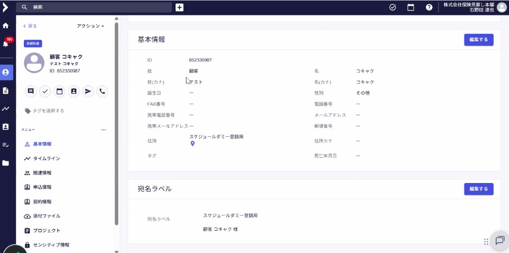
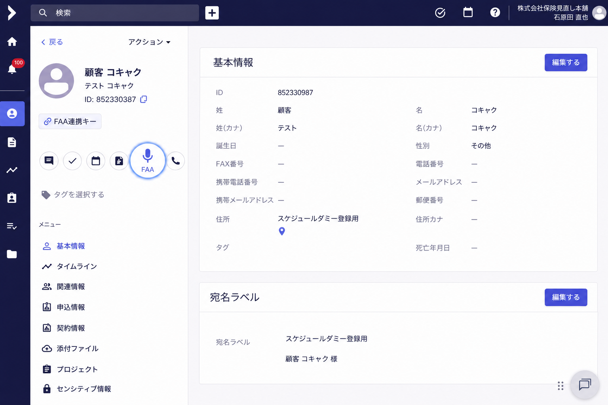

# hokan × FAA 連携 — 業務要求

> [!IMPORTANT]
> **画面付き版（推奨・Before/After 画像あり）**  
> → **[hokan × FAA 連携 — 業務要求（画面付き）](保険見直し本舗/hokan_FAA連携/hokan×FAA連携_業務要求.md)**

このファイルはテキストのみの要約です。開発・受入の共通認識には **上記リンク先** をご利用ください。

| 画面 | Before | After |
| --- | --- | --- |
| hokan 顧客ページ |  |  |

---

## 1. 背景・目的

| 項目 | 内容 |
|------|------|
| 対象システム | **hokan**（顧客・案件管理）、**FAA**（面談支援・AIメモ等） |
| 業務シーン | **面談前**。担当者は hokan の**顧客ページ**で顧客情報を確認したうえで面談に臨む |
| 連携の目的 | 面談前後の文脈（顧客情報）を維持したまま FAA を利用し、FAA 由来の記録を hokan 側で把握・共有できるようにする |

---

## 2. 前提（業務フロー）

1. 担当者は面談前に hokan の**顧客ページ**を開いている。
2. 顧客ページには基本情報・案件情報・活動記録などが表示されている。
3. この顧客ページからFAAの録音画面に遷移できる状態にする。
4. FAA 利用時も、**同一顧客の文脈**（氏名・連絡先・契約状況等）が途切れないことが求められる。

---

## 3. 業務要求一覧

### BR-01 顧客情報の保持（面談前コンテキスト）

| ID      | 要求                                                     |
| ------- | ------------------------------------------------------ |
| BR-01-1 | 面談前に hokan 顧客ページで表示されている**顧客情報が、FAA 連携時も保持・引き継がれる**こと。 |
| BR-01-2 | 担当者が FAA に遷移・起動した際、**別顧客と取り違えない**こと（操作中の顧客が明示されること）。   |

**受入の目安:** FAA 画面（または連携先）で、hokan 顧客ページと整合する顧客属性（少なくとも識別子・氏名等）が確認できる。

---

### BR-02 顧客ページへの FAA ボタン表示

| ID      | 要求                                                        |
| ------- | --------------------------------------------------------- |
| BR-02-1 | hokan **顧客ページ**に **「FAA」ボタン**（または同等の導線）を表示すること。           |
| BR-02-2 | ボタン操作により、**当該顧客を文脈として FAA を起動・遷移**できること。                  |
| BR-02-3 | 表示位置は、顧客サマリー付近の既存アクション（メール・カレンダー等）と整合し、**面談前の操作で迷わない**こと。 |

**受入の目安:** 顧客ページを開いた状態で FAA ボタンが常時（または業務ルールに応じた条件下で）表示され、1 操作で FAA 連携が開始できる。

---

### BR-03 顧客 ID による紐づけ（連携キー）

| ID | 要求 |
|----|------|
| BR-03-1 | hokan 顧客ページ**左上サマリーに表示される顧客 ID**（例: `852330387`）を、hokan と FAA 間の**共通紐づけキー**とすること。 |
| BR-03-2 | FAA 側の顧客・セッション・メモは、**当該 hokan 顧客 ID と 1:1（または業務定義どおりの対応）**で関連付けられること。 |
| BR-03-3 | ID が不一致・未登録の場合は、**誤連携を防ぐ**エラーまたは案内を行うこと（サイレントな別顧客紐づけは不可）。 |

**受入の目安:** 同一顧客 ID で hokan 顧客ページと FAA 上の記録が突合できる。ID 変更・重複時の運用ルールは別途定義。

---

### BR-04 FAA メモの別タブ作成

| ID | 要求 |
|----|------|
| BR-04-1 | 活動記録（面談活動記録等）において、**通常の hokan メモ／活動記録と FAA 由来のメモを分離**すること。 |
| BR-04-2 | **FAA 用メモは専用タブ（または専用区分）**で作成・表示・編集できること。 |
| BR-04-3 | FAA メモには、**FAA 連携であることが識別可能**であること（ラベル・作成元・作成日時等）。 |
| BR-04-4 | 既存の面談活動記録 UI（日時・同席者・添付・通知設定等）との関係は、**FAA タブ側で必要な項目のみ**を持つ（重複入力の最小化）。 |

**受入の目安:** 活動記録画面で「通常」と「FAA」がタブ等で明確に分かれ、FAA メモのみが FAA タブに蓄積される。

---

### BR-05 FAA メモ作成時の通知

| ID | 要求 |
|----|------|
| BR-05-1 | **FAA 用メモが新規作成されたタイミング**で、hokan 既存の**通知機能**を用いて関係者へ通知すること。 |
| BR-05-2 | 通知のオン／オフ、通知先ユーザーは、既存の「通知を送信する」等の仕組みと**整合**させること（業務ルールで必須化する場合は明示）。 |
| BR-05-3 | 通知内容から、**どの顧客（顧客 ID・氏名）の FAA メモか**が判別できること。 |

**受入の目安:** FAA メモ保存後、設定に応じて通知が送信され、受信者が顧客とメモ種別を識別できる。

---

## 4. 画面・操作イメージ（業務要求との対応）

**全画面の Before/After:** [業務要求（画面付き）](保険見直し本舗/hokan_FAA連携/hokan×FAA連携_業務要求.md)

| 画面要素（hokan） | 業務要求 |
|-------------------|----------|
| 顧客ページ・基本情報／案件情報 | BR-01（情報保持） |
| 左上サマリー `ID: xxxxx` | BR-03（紐づけキー） |
| 顧客サマリー付近アクション | BR-02（FAA ボタン） |
| 面談活動記録モーダル | BR-04（FAA 別タブ）、BR-05（通知） |

---

## 5. スコープ外・要確認事項（業務）

以下は本メモ時点では**未確定**。要件確定時に決める。

| #   | 確認事項                                 |
| --- | ------------------------------------ |
| Q1  | FAA ボタン押下時 — **新規タブ／同一タブ／アプリ起動**のどれか |
| Q2  | FAA 未連携顧客（ID のみ hokan 側）の**初回登録**フロー |
| Q3  | FAA メモの**編集・削除**権限と履歴                |
| Q4  | 通知の**デフォルト ON/OFF** と必須通知先（チーム・上長等）  |
| Q5  | 通常活動記録と FAA メモの**検索・一覧表示**の統合／分離     |
| Q6  | 個人情報・監査ログ・保存期間など**コンプライアンス**要件       |

---

## 6. 受入テスト観点（業務レベル）

1. 顧客ページ表示中、FAA ボタンから FAA に遷移し、**同一顧客 ID** の文脈が FAA 側に反映されている。
2. FAA タブでメモ作成後、hokan 上で **FAA タブのみ** に記録が残る（通常タブと混在しない）。
3. メモ作成後、通知設定に従い**通知が送信**され、顧客 ID／氏名が通知から分かる。
4. 顧客 ID 不一致時、**誤った顧客への紐づけが発生しない**。

---

## 7. 改訂履歴

| 日付 | 内容 |
|------|------|
| 2026-05-22 | 面談前顧客ページ・FAA ボタン・ID 紐づけ・FAA 別タブメモ・通知 — 初版業務要求 |
| 2026-05-21 | GitHub 向けに画面付き版へのリンク・プレビュー画像を追加 |
