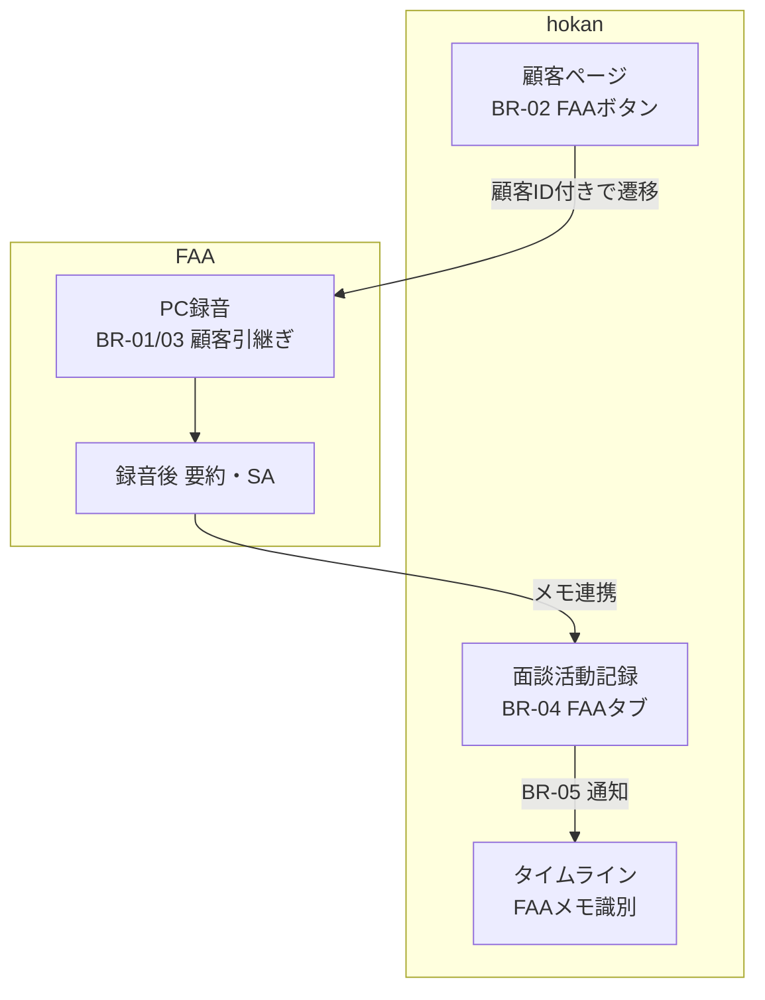

---
tags:
  - 保険見直し本舗
  - hokan
  - FAA
  - 業務要求
  - 要件定義
date: 2026-05-22
status: ドラフト
---

# hokan × FAA 連携 — 業務要求（画面付き）

> [!abstract] この資料の目的
> 面談**前**に hokan の顧客ページから FAA へスムーズに遷移し、**同一顧客の文脈**を保ったまま録音・要約し、結果を hokan に **FAA 専用タブ**で残すための業務要求です。
> **Before / After の画面イメージ**付きで、開発・受入の共通認識を取ることを目的とします。

**関連ノート:** [[0522_hokan連携要件定義]]（テキスト版）  
**画像フォルダ:** `assets/`

---

## 一覧で把握する（要求サマリー）

| ID        | テーマ       | ひとことで                                |
| --------- | --------- | ------------------------------------ |
| **BR-01** | 顧客情報の保持   | hokan で見ていた顧客が、FAA でもそのまま分かる         |
| **BR-02** | FAA ボタン   | 顧客ページから **1 クリック**で FAA へ            |
| **BR-03** | 顧客 ID 紐づけ | `ID: 852330387` などを **共通キー**に誤紐づけを防ぐ |
| **BR-04** | FAA 別タブ   | 通常メモと FAA メモを **タブで分離**              |
| **BR-05** | 通知        | FAA メモ作成時に、**誰の・どの顧客の**メモか通知         |

---

## 業務シーンと画面の流れ（弊社改修範囲はFAAのみ）

| 手順  | 担当者の操作                     | 確認する画面                              |
| :-: | -------------------------- | ----------------------------------- |
|  1  | 面談前に hokan で顧客を開く          | [[#画面1 hokan 顧客ページ（BR-02・BR-03）]]   |
|  2  | **FAA** ボタンを押す             | 同上 → [[#画面4 FAA PC録音（BR-01・BR-03）]] |
|  3  | 顧客が入った状態で録音                | 画面4                                 |
|  4  | 終了後、要約を確認                  | FAA 一覧ビュー（別資料）                      |
|  5  | hokan で活動記録の **FAA タブ**を確認 | [[#画面2 面談活動記録（BR-04・BR-05）]]        |
|  6  | 必要に応じて通知                   | 画面2 フッター                            |
|  7  | タイムラインで履歴確認                | [[#画面3 タイムライン（BR-04 補助）]]           |

---

## 画面1 hokan 顧客ページ（BR-02・BR-03）

### 業務要求

| ID      | 要求                                  |
| ------- | ----------------------------------- |
| BR-02-1 | 顧客ページに **「FAA」ボタン**を表示              |
| BR-02-2 | ボタンで **当該顧客の文脈**のまま FAA へ遷移         |
| BR-02-3 | 既存アクション（メール・カレンダー等）付近に配置し **迷わない**  |
| BR-03-1 | サマリーの **顧客 ID** を hokan・FAA 共通キーとする |

### Before → After

> [!warning] Before（現状）
> - 顧客 ID は表示されているが、**FAA への導線がない**
> - 面談前に FAA を開く操作が不明確

![[Before_01_hokan_顧客ページ.png]]

> [!success] After（あるべき姿）
> - サマリー横に **FAA ボタン**（強調表示）
> - **ID が連携キー**であることが視覚的に分かる

![[After_01_hokan_顧客ページ_FAAボタン.png]]

**受入の目安:** 顧客ページで FAA ボタンが見え、**1 操作**で FAA が開く。

---

## 画面4 FAA PC録音（BR-01・BR-03）

> [!tip] なぜこの画面か
> FAA 側の紐づけ先は、添付要件どおり **「お客様」欄**（Meeting Information）です。

### 業務要求

| ID      | 要求                                 |
| ------- | ---------------------------------- |
| BR-01-1 | hokan の顧客情報（氏名等）が FAA に **引き継がれる** |
| BR-01-2 | **別顧客と取り違えない**（操作中顧客が明示）           |
| BR-03-2 | 録音・メモが **hokan 顧客 ID** に紐づく        |
| BR-03-3 | ID 不一致時は **エラー／案内**（サイレント紐づけ不可）    |

### Before → After

> [!warning] Before（現状）
> - **お客様が未設定**（手動で追加・登録が必要）
> - hokan から来た文脈がなく、**取り違えリスク**がある

![[Before_04_FAA_PC録音_お客様未設定.png]]

> [!success] After（あるべき姿）
> - **氏名 + hokan ID** が自動入力（編集不可）
> - 「hokanから連携」「顧客確認済み」で安心して録音開始

![[After_04_FAA_PC録音_顧客引継ぎ.png]]

**受入の目安:** お客様欄に hokan と同じ顧客が表示され、手入力なしで録音できる。

---

## 画面2 面談活動記録（BR-04・BR-05）

### 業務要求

| ID | 要求 |
|----|------|
| BR-04-1 | 通常メモと **FAA 由来メモを分離** |
| BR-04-2 | **「FAA」専用タブ**で表示・編集 |
| BR-04-3 | FAA 連携であることが **ラベル等で識別可能** |
| BR-04-4 | FAA タブは **必要項目のみ**（入力の重複を減らす） |
| BR-05-1 | FAA メモ **新規作成時**に通知 |
| BR-05-3 | 通知から **顧客 ID・氏名**が分かる |

### Before → After

> [!warning] Before（現状）
> - **単一の入力画面**のみ（手入力メモ）
> - FAA 要約と通常メモの区別がない

![[Before_02_hokan_活動記録.png]]

> [!success] After（あるべき姿）
> - タブ **「通常」｜「FAA」** で明確に分離
> - FAA タブに AI 要約・**FAA連携**バッジ
> - フッターで **FAAメモ作成時の通知**（既存 UI と整合）

![[After_02_hokan_活動記録_FAAタブ.png]]

**受入の目安:** FAA メモが通常タブに混ざらず、FAA タブだけに蓄積される。

---

## 要求と画面の対応表（トレーサビリティ）

| 画面要素          | BR-01 | BR-02 | BR-03 | BR-04 | BR-05 |
| ------------- | :---: | :---: | :---: | :---: | :---: |
| 顧客ページ・ID 表示   |   ○   |   ○   |   ○   |       |       |
| 顧客ページ・FAA ボタン |       |   ○   |   ○   |       |       |
| FAA・お客様欄      |   ○   |       |   ○   |       |       |
| 活動記録・FAA タブ   |       |       |       |   ○   |   ○   |
| 活動記録・通知       |       |       |       |       |   ○   |

---

## 受入テスト（業務レベル・チェックリスト）

- [ ] **TC-1** 顧客ページの FAA ボタンから遷移し、FAA のお客様欄に **同一 ID** が表示される
- [ ] **TC-2** FAA タブにだけメモが保存され、通常タブと **混在しない**
- [ ] **TC-3** メモ保存後、通知 ON 時に **顧客 ID・氏名**が通知から分かる
- [ ] **TC-4** ID 不一致時、**別顧客に紐づかない**（エラーまたは案内）

---

## 改訂履歴

| 日付 | 版 | 内容 |
|------|-----|------|
| 2026-05-22 | 0.1 | 業務要求初版 |
| 2026-05-22 | 1.0 | Before/After 画面 4 点追加、Obsidian 用に再構成 |
